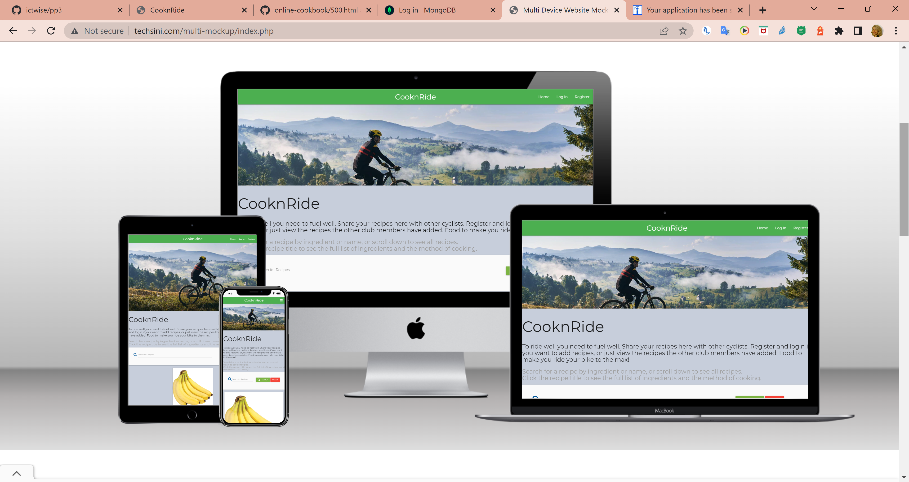
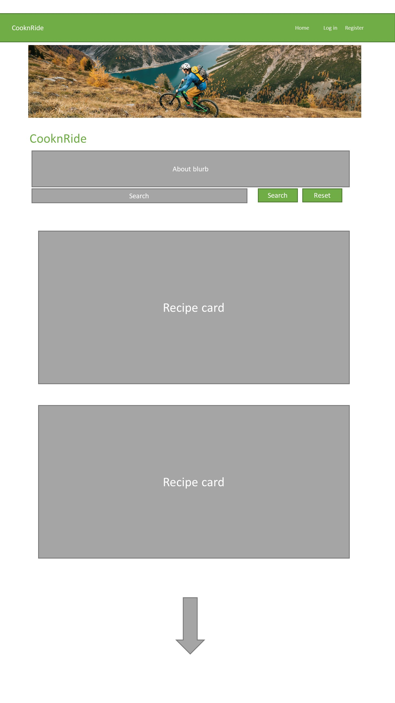
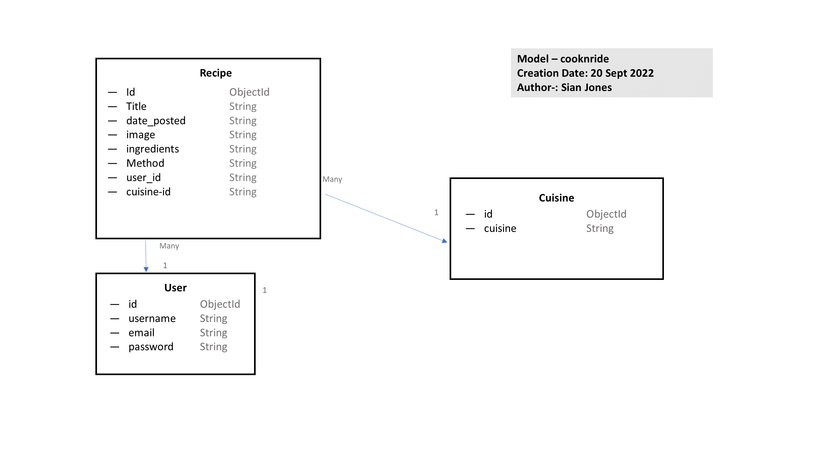

# CooknRide Recipes to Ride By!

 

[View live website here!](https://flask-recipe-project-sian.herokuapp.com/get_recipes)

[View GitHub repository here!](https://github.com/ictwise/pp3)

 

 

Fueling for your ride is important if you want to get in the miles and the speed. Share your favourite recipes here. 

 

## Table of contents

___

1. [**User Experience**](#ux)
    * Project Goals
    * Business Goals
    * User Goals
    * User Stories
    * Design Choices
        * Color scheme
        * Typography
    * Wireframes

2. [**Features**](#features)
    * Existing Features
    * Features Left to Implement

3. [**Database Design**](#database-design)

4. [**Technologies Used**](#technologies-used)
    * Languages 
    * Frameworks, Libraries & Programs

5. [**Testing**](#testing)
    * Testing User Stories from User Experience (UX) Section
    * Further Testing
    * Known Bugs

6. [**Deployment**](#deployment)
    * GitHub Pages
    * Forking the GitHub Repository
    * Making a Local Clone

7. [**Credits**](#credits)

 

# UX

## Project Goals

 

The purpose of this project is to 

*"...build a site that allows your users to manage a common dataset about a particular domain"* using HTML, CSS, JavaScript, Python+Flask, MongoDB and PostgreSQL. 

*"Design a fully-functioning, interactive, Full Stack application, with well-designed data and
a full set of CRUD data operations."*

## Business Goals

 

Create a web application that allows users to:
    
* Add their own recipes to the website (CREATE)
* Find recipes submitted by other cyclists (READ)
* Edit their recipes (UPDATE)
* Delete their recipes (DELETE)
    
**The purpose is to get members of a cycling club to engage with each other, share 'fuelling' tips and to build a sense of community amongst club members**

The site targets a specific group of people members of a cycling club and anyone interested in cycling performance. The emphasis is on healthy eating, but also fuelling performance. The design is mobile first.

Eventually the recipe database will increase in both recipes and users/visitors. The site offer users to interact by adding their own recipes that makes the user feel like being a part of "the community". 

## User Goals

 

Find and share recipes. Get inspired by the recipes and get inspired to add/share own recipes at the site which fuel and improve your ride. 

## User Stories

 

* First Time Visitor Goals

    * As a first time visitor, I want to easily understand the main purpose of the site.
    * As a first time visitor, I want the site navigation to be intutive, user friendly and over all ease-of-use.
    * As a first time visitor, I want to find recipes that will improve my cycling performance.
    * As a first time visitor, I want to easily access the recipes. 
    * As a first time visitor, I want to be able to create, read, update, delete and search for recipes.
    * As a first time visitor, I want to be able to take part of this community/recipe bank by be able to register. 

 

* Returning Visitor Goals

    * As a returning visitor, I want to be able to easily register if I didn't last time visiting. 
    * As a returning visitor, I want to be able to easily log in, if I registered last time visiting. 
    * As a returning visitor, I want to be able to create, read, update, delete and search for recipes.
    * As a returning visitor, I want to be able to reach out to siteowner for any possible questions.

 

## Design Choices

 

* Color scheme

The intention of this project is to be an add-on for the website of a local cycling club. The club colours are Green with a red and blue accent. White is used as the background with the occasional grey to soften the effect.
    

* Typography

    Montserrat is the main font used throughout the site. Montserrat has a clean and modern vibe.
    

 

## Wireframes 

 

 

# Features

## Existing Features 

 
The application can be used with or without a user login, however some features are only available to logged in users.

Any user of the website is able to search for specific keywords in a recipe name or ingredients and view a list of results. The search function ONLY returns results with the search term in the recipe name or ingredients, no cuisines are searched. From the results they can then view a specific recipe's page. 
Users can create an account, this is very basic in that usernames and passwords are stored in the database in PostgreSQL. Once an account has been created and users are logged in, they will have the option to add their own recipes and manage the recipe (adding and deleting). Only the Admin user can manage Cuisines.
Adding a recipe will create a new document in the database's 'Recipes' collection (MongoDB). That recipe will then be available to search and view along with the rest.

Every page of the website features a consistently responsive and intuitive layout and navigational system:

**General features**
* Fixed navbar to be seen at all times.
* Responsive site on all devices. 
* Fixed on top of the page on all device sizes.
* Shown as a collapsible navbar (hamburger button) triggered at tablets and mobile devices. 
* Search bar allowing visitors to search for recipes. 

**Recipes/Home Page**
* Visitors/Users can search for recipes.
* Features a clean search bar for user to search. 
* Visitors/Users can read recipes.
* Visitors/Users can see who added the recipes.
* Registration, visitors allows to register.

**Log In Page**
* Log In is possible after registered.
* User gets a success message.
* Features a clean log in form for user to log in.
* Users can be redirected directly to Registration Page if not already registered.
* User get redirected to Profile Page after login in.

**Log Out**
* User get redirected to Log In Page after login in.
* User gets a success message when loged out to verify user loged out.
* Features a clean log out form for user to log out.

**Register Page**
* Registration, visiters allows to register.
* User gets a "welcome message" at Profile page when registered to verify user registration. 
* Features a clean registration form for visitor to sign up.
* Visitor can be redirected directly to Log In Page if already registered.
* User get redirected to Profile Page after registered.

**Profile Page**
* Welome message, Home New Recipe and Log Out links diplayed (Mangage Cuisines if user is Admin)

**Add Recipes**
* User can choose between categories, add a recipe name, image url, add ingredients and method for the recipe.
* User gets a success message when added a recipe to verify adding recipe completed.
* Features a clean form for user to add a recipe.
* Done adding recipe get redirected to Recipes Page.

**Edit Recipe**
* Edit one or more sections in the recipe (only recipes added by user them self).
* User gets a success message when edited a recipe to verify updated recipe completed.
* Delete a recipe (only recipes added by user them self).
* Features a clean form for user to edit, delete or cancel.
* Each section is pre-filled with data provided when adding recipe in first place. 
* Done editing recipe get redirected to Recipe Page.

**Delete Recipe**
* User gets a success message when deleting a recipe to verify recipe now deleted. 

 

## Features left to implement
* custom 500 error pages
* Be able to search through cuisines, kind of food (High Protien, Low Fat etc).
* Ability to reset an account password.
* User profile picture functionality, allowing users to add profile pictures.
* Allowing/Enabling users to comment/star the recipes.
* Easier to get contacted by business partners regarding any collaboration, business deals and sponsorship.
* Get more contact information about the registered users to be able to reach out (newsletters, offers etc).
* Upload of images and storage in cloudinary.
* Pagination

 

 

# Database Design

 

MongoDB Atlas is used as database backend for storing recipes details, PostgreSQL for storing user and cuisine details . This is to take advantage of the flexibility of MongoDB and the structure of PostgreSQL. There are three collections; 

 

## Database schema

 

## My Project Plan

* create mongoDB for recipies (password stored in notes- available on request)
* create flask app - run hello world
* Heroko create requirments
* Prockfile connect to heroku
* connect Flask to Mongo, create psql for user and cuisine and connect, create recipe page and view first record.
* template directory, base and recipe there.
* materialise and static files check css is working
* Add nav bar
* user auth and register create
* add register functionality
* login functionality
* display user profile
* logout
* home page setup - cards setup
* add recipe page
* recipe input fields
* cuisine selection on new recipe
* Allow user to submit recipe to db 
* Adding Edit And Done Buttons
* Wire up recipe edit button
* Bind data to the Edit recipe form'".
* Update recipe into the database'.
* Delete recipe from the database
* Add Manage cuisine template'"
* Add option to Add cuisine to db".
* Add edit cuisine option
* Add delete cuisine option

# Technologies Used

 

**Languages, Frameworks and Libraries**

 

* [BSON](https://bsonspec.org/) - bson.objectid is a required dependency for MongoDB management system.
* [CSS](https://developer.mozilla.org/en-US/docs/Web/CSS) - used to create the styling throughout the site.
* [Google fonts](https://fonts.google.com/) - used to import fonts.
* [HTML](https://developer.mozilla.org/en-US/docs/Web/HTML) - used to create the site structure.
* [Flask](https://flask.palletsprojects.com/en/1.1.x/) - framework used to create and populate the templates.
* [JavaScript](https://developer.mozilla.org/en-US/docs/Web/JavaScript) - used for the sidenav, back-to-top button, image preview.
* [Jinja](https://jinja.palletsprojects.com/en/3.0.x/) - Jinja templating language was used to simplify and display backend data in html.
* [jQuery](https://jquery.com/) - used to activate the Materialize functionality.
* [Materialize](https://materializecss.com/) - library used for styling and responsiveness.
* [PyMongo](https://pypi.org/project/pymongo/) - flask_pymongo was used for interacting with MongoDB database from Python.
* [Python](https://www.python.org/) - used to write the logic that operates the site.
* [Werkzeug](https://werkzeug.palletsprojects.com/en/2.0.x/) - used for password hashing and authentication.
* [PostgreSQL](https://www.postgresql.org/) - used for user and cuisine data
    
 

**Tools and Editors**

 

* [Am I Responsive](http://ami.responsivedesign.is/) - used to validate the responsiveness. 
* [PowerPoint] - used to create the wireframes.
* [Chrome DevTools](https://developer.chrome.com/docs/devtools/)  - used Lighthouse to check sites performance and the dev tool to check responsiveness.
* [Font-Awesome](https://fontawesome.com/) - used for icons.
* [Git](https://git-scm.com/) - used for version control to commit to Git and push to Heroku.
* [GitHub](https://github.com/) - used to store the projects code after being pushed from Git.
* [Gitpod](https://gitpod.io/) - IDE used for development.
* [Heroku](https://www.heroku.com/home) - cloud platform used to deploy application.
* [Jinja](https://jinja.palletsprojects.com/en/3.0.x/) - Jinja templating language was used to simplify and display backend data in html.
* [JSHint](https://jshint.com/) - used to test JS code to ensure there were no errors.
* [psycodestyle] - Used to check code for PEP8 requirements
* [TechSini](https://techsini.com/) - mockup generator used for preview of the  website.
* [gitpod](https://www.gitpod.io/) - IDE used for code editing.
* [W3C Validator](https://validator.w3.org/) - used to test HTML code to ensure there were no errors.
* [W3C Validator CSS](https://jigsaw.w3.org/css-validator/) - used to test CSS code to ensure there were no errors.

 

### Database Management

 

* [MongoDB](https://www.mongodb.com/3) - used for database functionality.
* [MongoDB Atlas](https://www.mongodb.com/cloud/atlas) - used to host the database.
* [PostgreSQL](https://www.postgresql.org/)

 

# Testing
See separate [testing.md file](testing/testing.md)

 

# Deployment

 

Requirements to deploy:

* An IDE (Gitpod)
* Python3 (In order to to run the application and use Flask)
* PIP3 (To install all application imports, such as Flask and OS)
* A template folder (To link app routes)
* Databases (MongoDB Atlas, PostgreSQL)

 

## GitHub Pages
1. Log into [GitHub](https://github.com/)
2. From the list of repositories, select the repository wanting to deploy.
3. From the menu items near the top of bthe page, select "Settings"
4. Scroll down to the GitHub Pages section.
5. Under "Source" click the drop-down menu labbelled "None" and select "Master Branch"
6. On selecting "Master Branch" the page is automatically refreshed, website is now deplyed. 
7. Scroll back down to the GitHub Pages section to retrieve the link to the deployed site. 

 

## Forking the GitHub Repository
Making a copy of the original repository on our GitHub account to view or to make changes without affecting the original repository;
1. Log into [GitHub](https://github.com/) and locate the repository.
2. At the top of the Repository, just above the "Settings" button on the menu, locate the "Fork" button.
3. You should now have a copy of the original repository in your GitHub account.

 

## Making a Local Clone
1. Install the Gitpod Browser Extentions for Chrome.
2. After installation, restart the browser. 
3. Log in to [Gitpod](https://www.gitpod.io/) with your gitpod account.
4. Navigate to the Project GitHub repository.
5. Click the green "Gitpod" button in the top right corner of the repository.
6. This triggers a new gitpod workspace to be created from the code in GitHub where you can work locally.

## To work on the project code within a local IDE 
1. Log in to [GitHub](https://github.com/) and locate the GitHub Repository.
2. Under the repository name, click "Clone or download".
3. In the clone with HTTPs section, copy the clone URL for the repository.
4. Open the terminal in your local IDE.
5. Change the current working directory to the location where you want the cloned directory to be made.
6. Type **git clone**, and then paste the URL you copied in Step 3.
7. Press Enter. Your local clone will be created.

 

## Heroku Deployment
1. Before deploying your project create a requirements.txt file by running the following command in the CLI;

2. Create a Procfile file by running the following command in the CLI;

3. git add and git commit the new requirements and Procfile and then git push the project to GitHub.
3. Log in to [Heroku](https://dashboard.heroku.com/apps).
4. Select "New" on your dashboard and then select "Create new app".
5. Choose a name for your application, select your region, and then click "Create app".
6. From the app dashboard, navigate to "Deploy" tab.
7. From Deployment method select "Github" and confirm the linking of the Heroku app by clicking "Search" then select your repository name.
8. Once you select your repository, click on "Connect".
9. After you connected to your repository, click on "Settings" tab on your app dashboard, and click on "Reveal Config Vars" and add your configuration variables to Heroku.
10. Navigate to "Deploy" tab, and from Manual deploy choose your master branch, and click "Deploy Branch".
11. After you deployed your branch "Enable Automatic Deploys".
12. Site is successfully deployed, any further changes will automatically be updated everytime they are commited and pushed on Github.

 

# Credits
* My mentor Chris Quinn.
* Code Institute tutor support, were truly excellent.
* Slack very informative, seems like people have been through the same issues.
* Google and Stack Overflow.
* The Code Institute Combined Task Manager Walkthrough (from which I edited much of the code used, especially for the register/login sections).
* YouTube https://www.youtube.com/watch?v=MwZwr5Tvyxo&list=PL-osiE80TeTs4UjLw5MM6OjgkjFeUxCYH  & https://www.youtube.com/watch?v=mqhxxeeTbu0&list=PLzMcBGfZo4-n4vJJybUVV3Un_NFS5EOgX

Site for educational purposes only.
