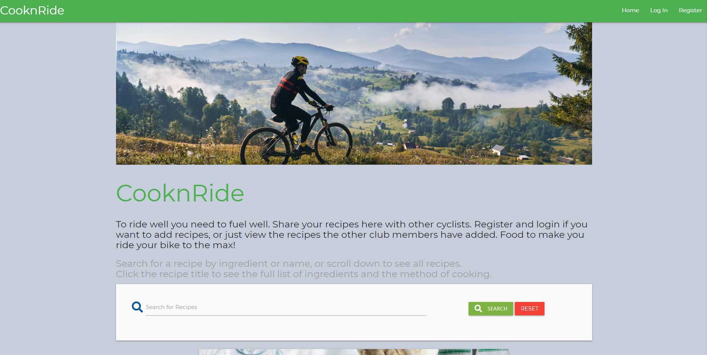
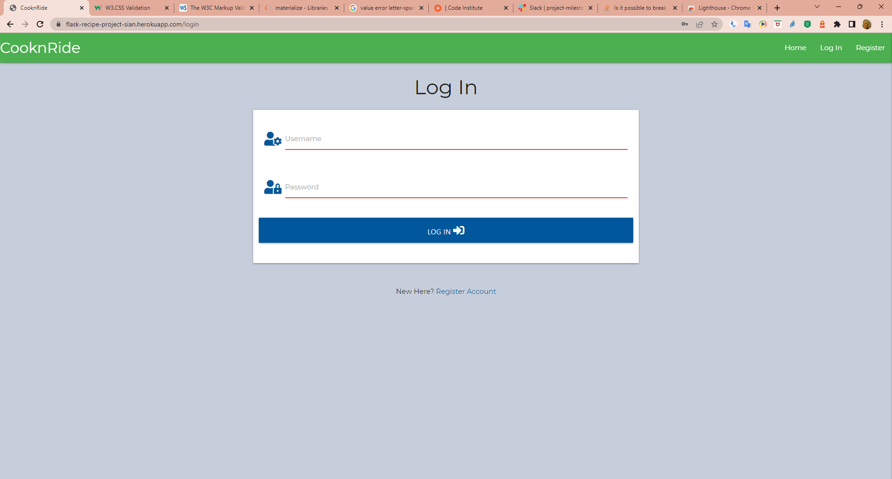
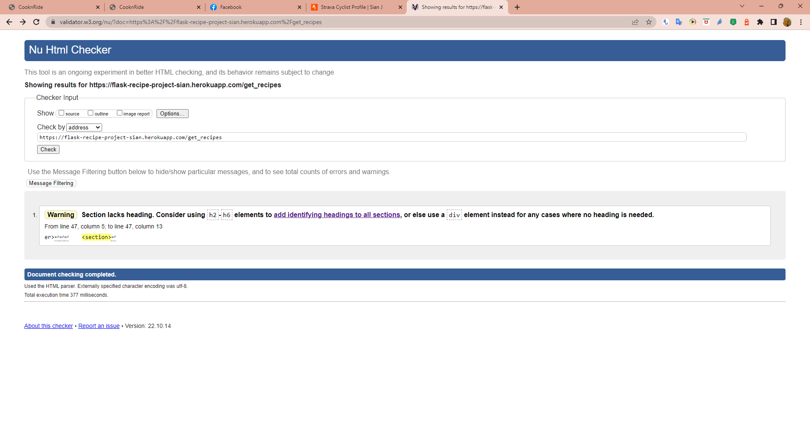
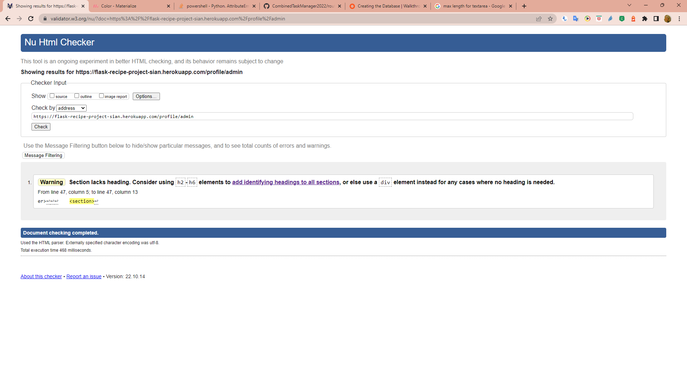
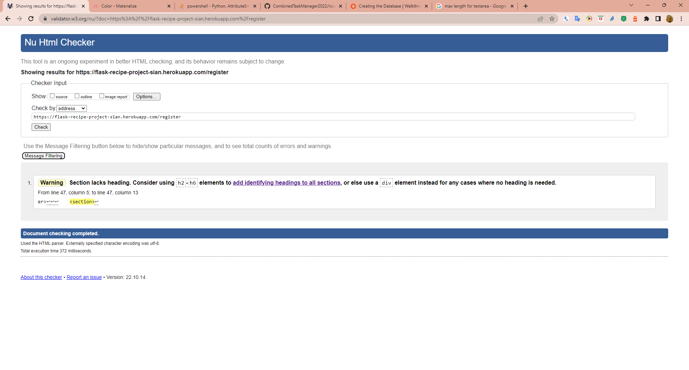
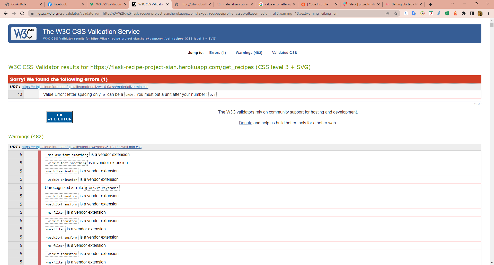
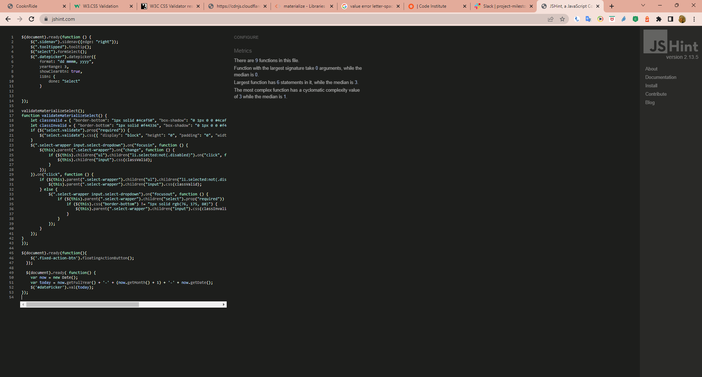
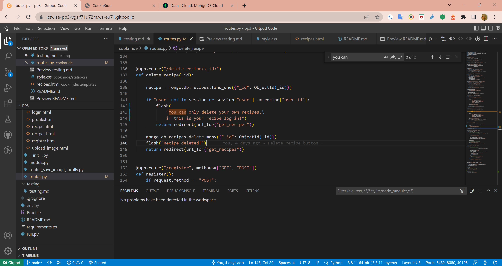
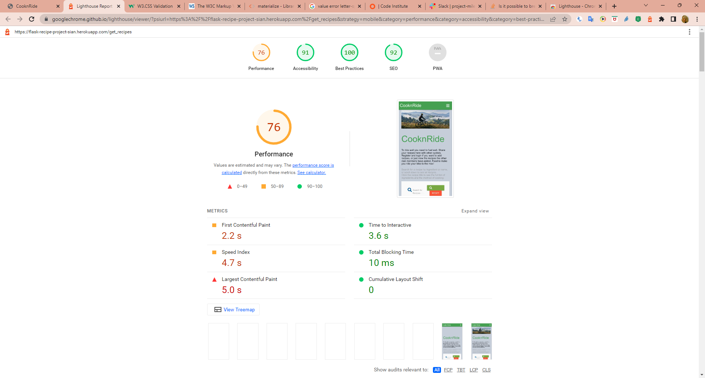

# Testing 

## CooknRide - recipes to fuel your ride

 

[View live website here!](https://flask-recipe-project-sian.herokuapp.com/get_recipes)

[View README.md here!](https://github.com/ictwise/pp3/blob/822cd2ee0cf43314c8418a4bfc19066ad8d21767/README.md)

 

## Contents Table

1. [**Testing User Stories from UX Design Section**](#testing-user-stories-from-ux-design-section)
    - **First Time Visitor Goals**
    - **Returning Visitor Goals**
  

2. [**Testing**](#testing)
  * Automated Testing
      - **W3C Markup Validator Results**
      - **W3C CSS Validator Results**
      - **JSHint Results**

  * Manual Testing

3. [**Bugs Discovered**](#bugs-discovered)

 

# Testing User Stories from UX Design Section

 

### First Time Visitor Goals

 

    * As a first time visitor, I want to easily understand the main purpose of the site.
    * As a first time visitor, I want the site navigation to be intutive, user friendly and over all ease-of-use.
    * As a first time visitor, I want to find recipes that will improve my cycling performance.
    * As a first time visitor, I want to easily access the recipes. 
    * As a first time visitor, I want to be able to create, read, update, delete and search for recipes.
    * As a first time visitor, I want to be able to take part of this community/recipe bank by be able to register. 

### Returning Visitor Goals

 

* Returning Visitor Goals

    * As a returning visitor, I want to be able to easily register if I didn't last time visiting. 
    * As a returning visitor, I want to be able to easily log in, if I registered last time visiting. 
    * As a returning visitor, I want to be able to create, read, update, delete and search for recipes.
    * As a returning visitor, I want to be able to reach out to siteowner for any possible questions.

 

# Testing

 

### Automated Testing

 

I used https://validator.w3.org/ to test all pages, no errors found. One warning was found I checked base.html and was satisfied that the lack of heading styles wasn't an issue.

 

<b>Click here for HTML Validator results</b>

- __Home__

  

- __Recipe__

  

- __Profile__

  

- __Log In__

  

- __Register__

  

- __Add Recipes__

  

<b>Click here for CSS Validator results</b>

- __CSS Validator Results__

  
  One error shows but this is form the materialize CDN and not part of my code.

<b>Click here for JSHint results</b>

- __JSHint Results__

  

<b>Click here for pycodestyle</b>

- __pycodestyle__

  

 

 

### Manual Testing

 

#### Responsive Design - PASS

 - All pages were tested using Chrome and Firefox, Edge. 
 - All pages tested for responsiveness in different device using Google Chrome Developer Tools and Am I Responsive
   - Desktop 
   - Galaxy Android phones
- All the pages were also tested manually using;
   - Samsung Galaxy S20

  
 

### Functionality Testing

 
  
#### Navbar - PASS
  
- All links are working and redirect the user to where they want to go next.
- Hamburger bar at smaller devices works.
- Logo works as link to home page.

  
#### Home/Recipe Page - PASS
  
- Registration button works.
- search works - both recipe title and name, the search is or, the reset button clears the search and returns all recipes.
- Search button works and starts a search function. 
- All recipe cards buttons "View Recipe" works and get the visitor to the recipe visitor wanted to view. 
- Delete and edit buttons will not work unless the user is logged in and the creator of the recipe
- All recipes are displayed in cards.
- All recipe cards buttons "View Recipe" work.

#####  Home/Recipe Page- logged in user - PASS
- Nav bar New recipe link appears and is working
- if user Admin Manage Cuisines link appears and is working.
- Edit button on recipe card works and allows user to easily edit their recipe. 
- Edit button redirects to edit page where all prior added conten is pre-filled.
- All editing works and generates a success message. 
- Delete button works as expected and deletes the recipe and generates a success message.
- Back to Recipes button works. 

#### Login - PASS
  
- Form inputs works. 
- Form validations work as expected and gives feedback regarding unmatched format, incorrect username, incorrect password, or if user doesn't exist in the database.
- Log In button works as expected and submits data successfully, and redirects user to Profile page.
- Register account link works.
- You cannot see the profile page unless logged in, typing into the address bar redirects to the login page.

#### Add Recipe - PASS
  
- All form inputs works, and stores the data in the database.
- Choose category dropdown works.
- Min and max length for text input works.
- Image preview works and show image before uploadadding the recipe. Preview image function on the form is responsive and all     images fits all devices sizes.
- Gluten Free switch works (on/off).
- Add Recipe button works and submits data and generate a successfull message.
- The added recipe ends up in Recipe Page as it should.  
  
#### Register - PASS
  
- Form inputs works. 
- Form validations work as expected and gives feedback regarding unmatched format, incorrect username, incorrect password, or if user doesn't exist in the database.
- Register button works as expected and submits data successfully, and redirects user to Profile page.
- Log In link works.
- Contact email address-link works.
  
#### Logout - PASS
  
- Logout functionality works = logs out user, and removes session cookies.
    
#### Manage Cuisines - PASS

- The manage cuisines link only appears for the Admin user
- Add Cuisine, edit and Delete links all work
- Any cuisines deleted will cascade through the recipe collection and delete all associated recipes.
- All added cuisines appear in the drop down on the add recipe page
  
### Security Testing
  
- Tested against Edit and Delete buttons working for other users added Recipes. **PASS**
- Tested Add Recipe page, not to choose category or fill the inputs fields with less text than min length. As well as for the max lenght or skip one or more input fields. **PASS**
- Tested register with a taken username. **PASS**
- Tested register with unallowed character and to few characters. **PASS**
- Tested typing links directly into address bar. **PASS**
  
### Google Lighthouse Testing 
  
  - All pages were tested using Google's Lighthouse.
  
  

<b>Click here for Lighthouse results</b>

  
 __Home__

  

 

# Bugs Discovered

**Solved Bugs**

The developer ran into several issues during the development of the site. The most memorable, along with the solution:

MongoDB has been updated since the combined walkthrough was created. 

    mongo.db.tasks.update({"_id": ObjectId(task_id)}, submit) 

no longer worked and had to be replaced with

    mongo.db.recipes.update_one({'_id': ObjectId(_id)}, {'$set': submit})

 

#### __[Back to Contents Table](#contents-table)__ 