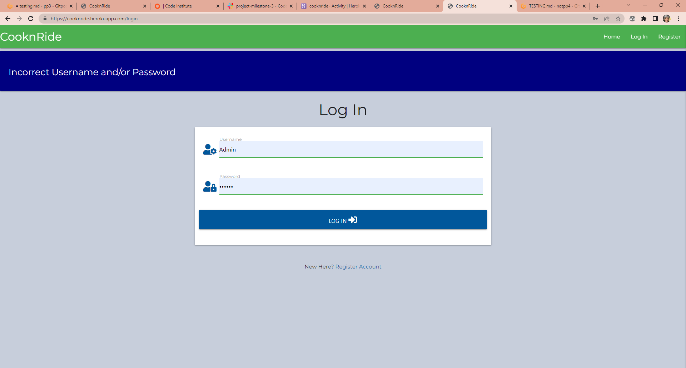
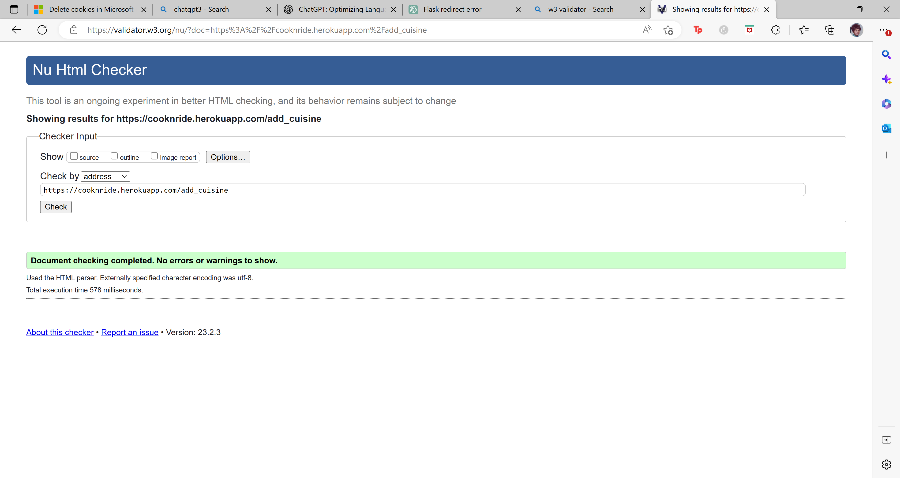
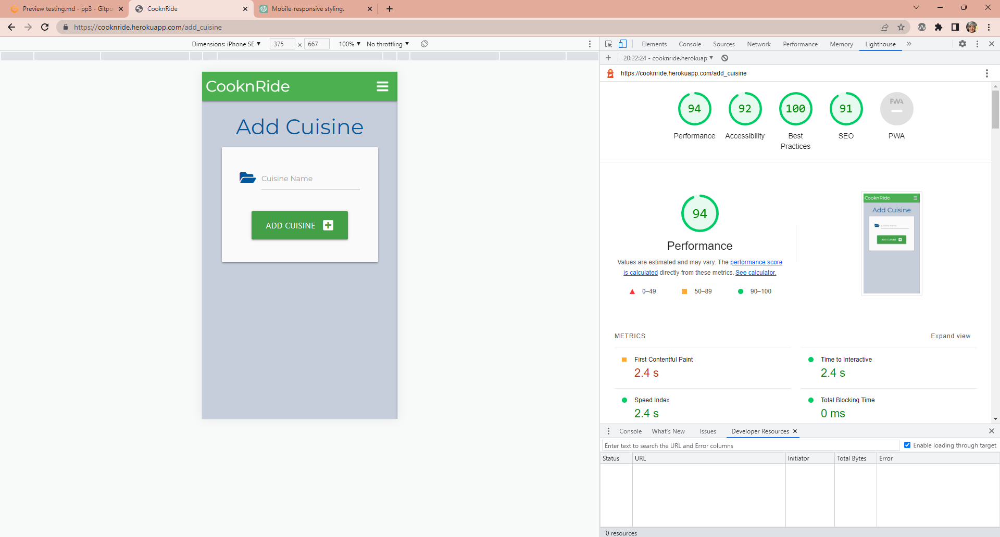

# Testing 

## CooknRide - recipes to fuel your ride

 

[View live website here!](https://flask-recipe-project-sian.herokuapp.com/get_recipes)

[View README.md here!](https://github.com/ictwise/pp3/blob/822cd2ee0cf43314c8418a4bfc19066ad8d21767/README.md)

 

## Contents Table

1. [**Manual Testing**](#manual-testing)

  * Testing Features
  * Navigation and Links Testing
  * Security Testing

  

2. [**Automated Testing**](#automated-testing)
  * Automated Testing
      - **W3C Markup Validator Results**
      - **W3C CSS Validator Results**
      - **JSHint Results**

  

3. [**Bugs Discovered**](#bugs-discovered)

 

## Manual Testing

### Testing  Features

This table presents test results for various features of cooknride. The tests include checking the appearance of links in the navigation bar, the login and registration processes, user access to the website, the ability to view, edit, and delete recipes, and the rendering of recipe detail pages. All tests have passed.

| Feature | Test | Pass/Fail | Image |
| --- | --- | --- | --- |
| The navigation bar displays links to the Logo, Home, Login, and Register pages when the user is not logged in. | Recipes.html and recipe.html have been tested for compatibility on multiple devices and browsers. | Pass |
| NavBar shows Logo, Home, New Recipe, Manage Cuisines and LogOut Links when user logged in. | All pages of the website have been tested for compatibility on multiple devices and browsers. | Pass |
| Login Username and Password combination not in the database | The website returns the login page with the message "Incorrect Username and/or Password" when an invalid combination of username and password is entered | Pass |
| Register User | A new user can be registered only if the entered username and email do not already exist in the database. | Pass |
| Users Can log in | Successfully logging in as an Admin user or logging in as a test user results in the display of the profile page with a welcome message. | Pass |
| Admin User can view edit delete recipies | The recipes page displays the view, edit, and delete buttons, only to Admin | Pass | 
| Non Admin users can only edit and delete their own recipies | The recipe page displays a view button next to all recipes. For non-logged-in users, only the view option is available. For logged-in users, edit and delete buttons are shown only next to recipes that they have created (unless Admin). | Pass |
| Delete recipe | Both the admin and the user who created a recipe are able to delete that recipe. | Pass |recipe deleted
| View recipe detail | Recipe details are accessible to anyone and they are displayed properly on all tested devices. | Pass | 
 |

### Navigation and Links Testing

 
  
#### Navbar - PASS
  
- All links are working and redirect the user to where they want to go next.
- Hamburger bar at smaller devices works.
- Logo works as link to home page.

  
#### Home/Recipe Page - PASS
  
- Registration button works.
- search works - both recipe title and name, the search is or, the reset button clears the search and returns all recipes.
- Search button works and starts a search function. 
- All recipe cards buttons "View Recipe" works and get the visitor to the recipe visitor wanted to view. 
- Delete and edit buttons will not work unless the user is logged in and the creator of the recipe
- All recipes are displayed in cards.
- All recipe cards buttons "View Recipe" work.

#####  Home/Recipe Page- logged in user - PASS
- Nav bar New recipe link appears and is working
- if user Admin Manage Cuisines link appears and is working.
- Edit button on recipe card works and allows user to easily edit their recipe. 
- Edit button redirects to edit page where all prior added conten is pre-filled.
- All editing works and generates a success message. 
- Delete button works as expected and deletes the recipe and generates a success message.
- Back to Recipes button works. 

#### Login - PASS
  
- Form inputs works. 
- Form validations work as expected and gives feedback regarding unmatched format, incorrect username, incorrect password, or if user doesn't exist in the database.
- Log In button works as expected and submits data successfully, and redirects user to Profile page.
- Register account link works.
- You cannot see the profile page unless logged in, typing into the address bar redirects to the login page.

#### Add Recipe - PASS
  
- All form inputs works, and stores the data in the database.
- Choose category dropdown works.
- Min and max length for text input works.
- Image preview works and show image before uploadadding the recipe. Preview image function on the form is responsive and all     images fits all devices sizes.
- Gluten Free switch works (on/off).
- Add Recipe button works and submits data and generate a successfull message.
- The added recipe ends up in Recipe Page as it should.  
  
#### Register - PASS
  
- Form inputs works. 
- Form validations work as expected and gives feedback regarding unmatched format, incorrect username, incorrect password, or if user doesn't exist in the database.
- Register button works as expected and submits data successfully, and redirects user to Profile page.
- Log In link works.
- Contact email address-link works.
  
#### Logout - PASS
  
- Logout functionality works = logs out user, and removes session cookies.
    
#### Manage Cuisines - PASS

- The manage cuisines link only appears for the Admin user
- Add Cuisine, edit and Delete links all work
- Any cuisines deleted will cascade through the recipe collection and delete all associated recipes.
- All added cuisines appear in the drop down on the add recipe page
  
### Security Testing
  
- Tested against Edit and Delete buttons working for other users added Recipes. **PASS**
- Tested Add Recipe page, not to choose category or fill the inputs fields with less text than min length. As well as for the max lenght or skip one or more input fields. **PASS**
- Tested register with a taken username. **PASS**
- Tested register with unallowed character and to few characters. **PASS**
- Tested typing links directly into address bar. **PASS**

## Automated Testing

 

I used https://validator.w3.org/ to test all pages, no errors found. 

 

<b> HTML Validator results</b>

- __Home__

  

- __Add Recipe__

  

- __Edit Recipe__

  

- __Profile__

  

- __Log In__

  

- __Edit Cuisine__

  

- __Add Cuisine__

  

- __Register__

  

- __Profile__

  

- __Recipe Detail__

  

<b> CSS Validator results</b>

- __CSS Validator Results__

  
  One error shows but this is form the materialize CDN and not part of my code.

<b>Click here for JSHint results</b>

- __JSHint Results__

  

<b>Click here for pycodestyle</b>

- __pycodestyle__

  

 

 

 

#### Responsive Design - PASS

 - All pages were opened using Chrome and Firefox, Edge. 
 - All pages tested for responsiveness in different device using Google Chrome Developer Tools and Am I Responsive
   - Desktop 
 - All the pages were also tested manually using;
   - Samsung Galaxy S20

  
 

  
### Google Lighthouse Testing 
  
  - All pages were tested using Google's Lighthouse.
  
  <b>Lighthouse results</b>
  
- __Home__

  

- __Add Recipe__

  

- __Edit Recipe__

  

- __Profile__

  

- __Log In__

  

- __Edit Cuisine__

  

- __Add Cuisine__

  

- __Register__

  

- __Profile__

  

- __Recipe Detail__

  

 

# Bugs Discovered

**Solved Bugs**

The developer ran into several issues during the development of the site. The most memorable, along with the solution:

MongoDB has been updated since the combined walkthrough was created. 

    mongo.db.tasks.update({"_id": ObjectId(task_id)}, submit) 

no longer worked and had to be replaced with

    mongo.db.recipes.update_one({'_id': ObjectId(_id)}, {'$set': submit})

 

#### __[Back to Contents Table](#contents-table)__ 